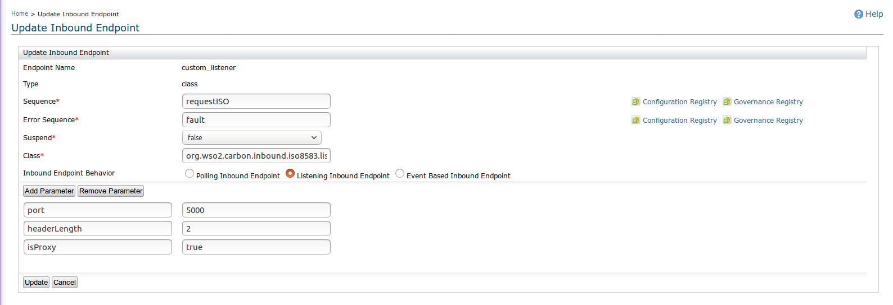

# Configuring ISO8583 Inbound Operations

ISO8583 Inbound endpoint allows the ISO8583 standard messages through WSO2 EI. ISO8583 is a message standard which is using in financial transactions. There are various versions in ISO8583 standard, Here the Inbound is developed based on 1987 version. For more information about ISO8583 Standard, go to [ISO8583 Documentation](https://www.iso.org/home.html).

WSO2 EI ISO8583 inbound endpoint acts as a message consumer. Since it is listening inbound, it is listening on port 5000. When a client is connected on port 5000 , WSO2 EI ISO8583 inbound starts to consume the ISO8583 standard messages and inject the messages in xml format into sequence.

In order to use the ISO8583 inbound endpoint, you need to download the inbound org.wso2.carbon.inbound.iso8583-1.0.0.jar from the [https://store.wso2.com/store/assets/esbconnector/details/iso8583](https://store.wso2.com/store/assets/esbconnector/details/e4cf3fd5-445f-4317-beb6-09998906fb0d), download the jpos-1.9.4.jar from the http://mvnrepository.com/artifact/org.jpos/jpos/1.9.4 , download jdom-1.1.3.jar from http://mvnrepository.com/artifact/org.jdom/jdom/1.1.3 and download commons-cli-1.3.1.jar from http://mvnrepository.com/artifact/commons-cli/commons-cli/1.3.1. Then copy the jars to the <EI_HOME>/lib directory. The recommend EI version is 6.1.1.

>> NOTE : jpos is the third party library , and jposdef.xml has the field definitions of the standard ISO8583 Messages. According to the field definitions each and every ISO8583 Messages which  comes from the client, will be unpacked and identify the fields of the ISO8583 Standard messages.

**Sample Configuration**

The inbound configuration can be added in the Inbound UI . Here the Port is the main  parameter and the client need to connect with inbound by using the port.



```xml
<inboundEndpoint
        class="org.wso2.carbon.inbound.iso8583.listening.ISO8583MessageConsumer"
        name="custom_listener" onError="fault" sequence="requestISO" suspend="false">
        <parameters>
            <parameter name="inbound.behavior">listening</parameter>
            <parameter name="port">5000</parameter>
            <parameter name="headerLength">2</parameter>
            <parameter name="isProxy">true</parameter>
        </parameters>
</inboundEndpoint>
```

**ISO8583 inbound endpoint parameters for sample configuration**

>>NOTE : To handle the concurrent messages in inbound , need to create the threadpool and it can contain a varying amount of threads. The number of threads in the pool is determined by these variables:
         corePoolSize           : The number of threads to keep in the pool , even if they are idle.
         maximumPoolSize  : The maximum number of threads to allow in the pool.
         Another parameter in threadPool configuration is keepAliveTime, Which is the maximum time that excess idle threads will be alive for new tasks before terminating.  
         
| Parameter| Description | Required | Possible Values | Default Value |
| ------------- |-------------| ---------------| ------------- |-------------|
| port    | Hosts have ports, socket connection will create according to that port and server started to listening to that port , once the socket connection is established. | Yes | 0-65535 | 5000 |
| headerLength    | The length of the header of ISO Message | No | 0, 2 or 4 | 0 |
| coreThreads | The number of threads to keep in the pool. | No | | |
| maxThreads | The maximum number of  threads to allow in the pool. | No | | |
| keepAlive | keepAlive	If the pool currently has more than corePoolSize threads, excess threads will be terminated if they have been idle for more than the keepAliveTime. | No | | |
| isProxy | isProxy defines whether this endpoint inbound is acting as a proxy for another backend service or processing the message itself. | No | true/false| false |

>> NOTE : To send ISO8583 Standard message to inbound, can use Java  clients applications. client need to produce the ISO8583 Standard messages and get the acknowledgement from inbound.
          A Sample test client program is provided in https://github.com/wso2-docs/CONNECTORS/tree/master/ISO8583/ISO8583TestClient. You can use this sample client to test the inbound.